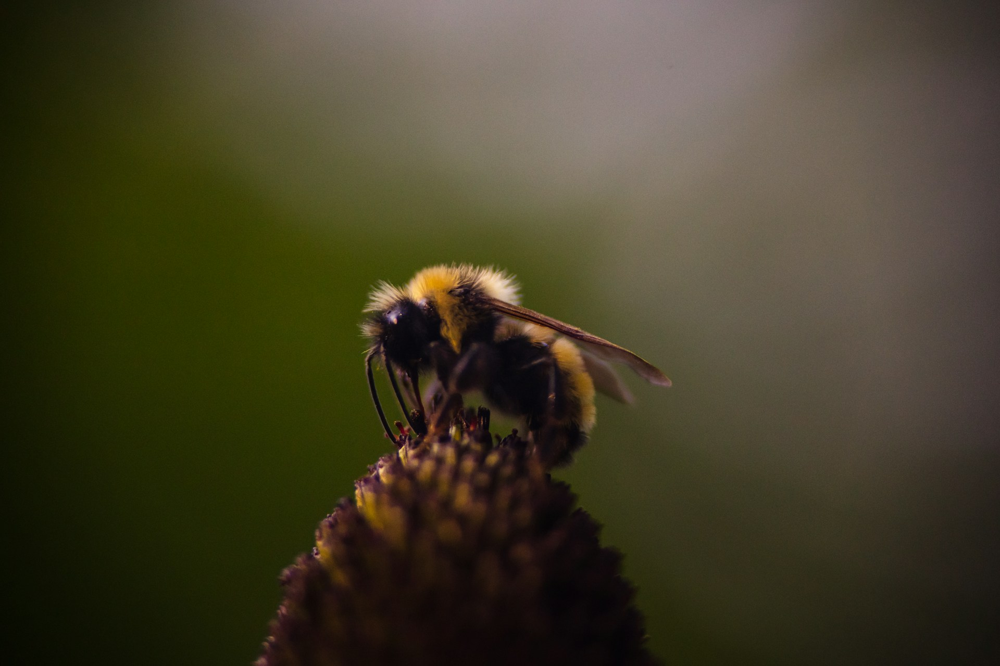

   
  
  [Photo Credit: Patrick Hendry from Unsplash](URL "https://unsplash.com/photos/brown-and-yellow-bee-perched-on-flower-wTmdA5W2NgU")

 # Naïve Bee Classification

#### Task: Image Classificaiton 
#### Libraries: Scikit Learn, Scikit Image, TensforFlow/Keras, Numpy
#### Lanuage: Python
#### Source: DataCamp
#### Project Background: 
&nbsp;&nbsp; Bees play a hug ecological role -- a powerful pollinater. Study them has become an important task for healthy of bee species and in large 
&nbsp;&nbsp; the health of ecology and agriculture.  

&nbsp;&nbsp; Species of bees have difference in appearances and behavior. but can a machine tell them apart?   

&nbsp;&nbsp; in this project, utlitize CNN to build a binary bee classifer ( honey bee vs bumble bee) that can help reseacher collect field data effectiely.  

#### [Notebook Link](https://github.com/mei-pan/Bee-Classification/blob/9509de84f13c9e8738508b75d252fcd6b0b37708/Nai%CC%88ve%20Bees%3A%20Deep%20Learning%20with%20Images/Nai%CC%88veBees_classify.ipynb)

